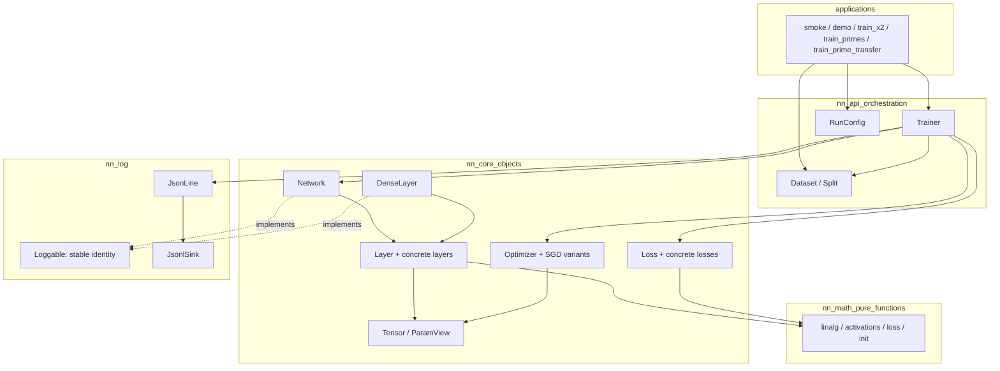
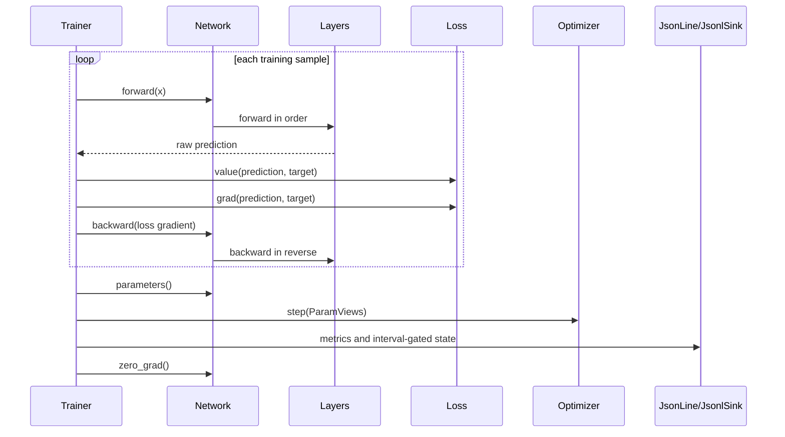

# Architecture

The project separates reusable numerical primitives, stateful neural-network objects,
orchestration, applications, and logging. Current implementation status is recorded in
[STATUS.md](STATUS.md); future phase work belongs in [ROADMAP.md](ROADMAP.md).

## Implemented layers



Dependencies flow downward: applications -> `nn::api` -> `nn::core` -> `nn::math`. `nn::log`
is a cross-cutting identity/output utility used by core and API code. Lower layers must not
depend on higher layers.

### 1. Math layer — `nn::math`

Pure, stateless free functions over `std::span` views. Callers own input/output storage; math
functions do not keep hidden state or allocate result buffers on the caller's behalf.

Implemented groups:

- linear algebra: matrix/vector operations and norms;
- activations: ReLU, tanh, sigmoid, and gradients;
- losses: MSE and numerically stable BCE-with-logits primitives;
- seeded Xavier/He initialisation.

Purity makes these functions easy to test with hand-computed cases and numeric gradient checks,
and leaves room for later CPU parallelism or alternate backends.

### 2. Object layer — `nn::core`

The domain model owns structure and mutable training state:

- `Tensor` is a row-major value type backed by `std::vector<double>`. It follows the **Rule of
  Zero**; vector already supplies correct copying, moving, and destruction.
- `Layer` is the abstract forward/backward/parameter interface. Concrete layers include
  `DenseLayer`, `ReluLayer`, `TanhLayer`, and `SigmoidLayer`.
- `Loss` is abstract; `MseLoss`, `BceWithLogitsLoss`, and
  `WeightedBceWithLogitsLoss` call `nn::math`.
- `Optimizer` is abstract; `Sgd` and `SgdWeightDecay` perform stateful in-place updates over
  `ParamView` records, skipping blocks marked frozen.
- `Network` owns an ordered `std::unique_ptr<Layer>` sequence, drives forward/backward, and can
  remove its final layer so an experiment can replace a pretraining head without copying the
  encoder.

Core objects call `nn::math` for reusable numerical primitives. Small operations inherently tied
to object state—such as an optimiser's in-place parameter update—remain in the owning core
object rather than creating a one-use math API.

### 3. API layer — `nn::api`

The current application-facing surface is:

- `RunConfig`: single-run hyperparameters, logging cadence, and optional staged-run metadata.
- `Dataset`/`Split`: `x^2` and primality data with named splits, row-major inputs, targets, and
  per-sample IDs. Prime data also supports a validation fraction and cyclic residue targets.
- `Trainer`: full-batch training, evaluation, optimisation, class-balanced metrics, and run
  artefact emission. Sequential phases can append to one run with continuous global steps.

`ExperimentRunner` is planned for Phase 6. It is not part of the current API.

### 4. Logging — `nn::log`

The implementation has three pieces:

- `Loggable`: stable `log_name()` identity only, implemented by `Network` and `DenseLayer`.
- `JsonLine`: hand-written builder for the primitive JSON values the project emits.
- `JsonlSink`: buffered writer with record-count and elapsed-time flushing.

`Trainer` serialises metrics directly and enumerates `Network::parameters()` for parameter rows.
There is no virtual `to_json()` contract and no third-party JSON dependency. See
[LOGGING.md](LOGGING.md).

## One training step



## Source layout

```text
src/
  includes/
    helpers/             # nn::math declarations
    classes/             # nn::core and nn::log declarations
    api/                 # nn::api declarations
  helpers/               # nn::math implementations
  classes/               # nn::core and nn::log implementations
  api/                   # nn::api implementations
  app/
    smoke/               # toolchain proof
    demo/                # small C++ demo
    train_x2/            # x^2 experiment
    train_primes/        # primality experiment
    train_prime_transfer/ # modulo-pretrained frozen-encoder prime experiment
    python/              # not built by CMake
      test_dashboard.py
      network_demo.py
      live_plot.py
      primes_plot.py      # class-balanced prime generalisation dashboard
tests/                   # doctest suite and numeric gradient checks
runs/                    # generated per-run artefacts (gitignored)
```

Headers are included by bucket, for example `#include "helpers/linalg.hpp"`.

| Folder (`includes/` + implementation) | Namespace(s) | Contents |
|---|---|---|
| `helpers/` | `nn::math` | Pure free numerical functions |
| `classes/` | `nn::core`, `nn::log` | Tensors, layers, losses, optimisers, network, logging utilities |
| `api/` | `nn::api` | Datasets, run configuration, and training orchestration |

All current library `.cpp` files are registered in `src/CMakeLists.txt`. Each C++ application
subdirectory has its own `main.cpp` and CMake target; Python scripts are deliberately excluded
from CMake.

## Planned extensions

- **Phase 6:** `ExperimentRunner` for isolated concurrent runs.
- **Phase 7:** reusable `query.py`, `make_video.py`, and Parquet analysis path.
- **Phase 8:** intra-operation CPU parallelism behind `nn::math`.
- **Phase 9:** optional GUI or alternate/GPU math backend.

Future components must not be described as implemented until present, registered, tested, and
reflected in [STATUS.md](STATUS.md).
