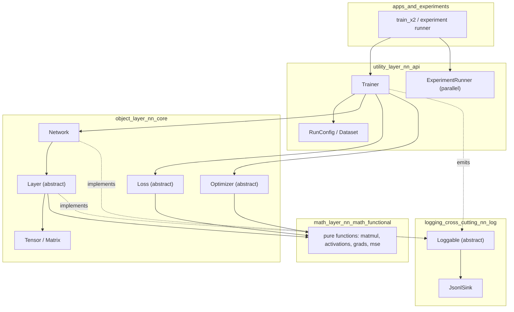
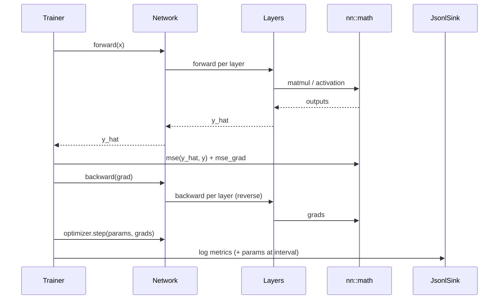

# Architecture

The project is organised into **layers** with deliberately different programming paradigms.
The goal: keep the numerical core pure and testable, keep domain objects clean and
polymorphic, and keep orchestration (the "API" we call from experiments) separate.

## The layers



### 1. Math layer — `nn::math` (functional)

Pure, stateless free functions. No ownership, no classes, no hidden state. They operate on
lightweight views (`std::span<const double>` / `std::span<double>`) so they never allocate on
the caller's behalf unless asked.

Why functional here: math ops are the most reused, most unit-testable, and most parallelisable
part. Purity makes them trivial to test (numeric gradient checks) and later to hand to threads
or a GPU backend without worrying about shared state.

Examples we'll build: `matmul`, `axpy`, `relu` / `relu_grad`, `tanh_grad`, `mse` / `mse_grad`,
`xavier_init`, `he_init`.

### 2. Object layer — `nn::core` (OO + polymorphism)

The domain model. This is where inheritance/polymorphism earns its place:

- `Tensor` / `Matrix` — value type holding data + shape (rule of 5, see
  [CPP_CONVENTIONS.md](CPP_CONVENTIONS.md)).
- `Layer` — abstract base with virtual `forward` / `backward`; concrete `DenseLayer`,
  `ReluLayer`, `TanhLayer`.
- `Loss` — abstract base; concrete `MseLoss`.
- `Optimizer` — abstract base; concrete `Sgd`, `SgdWeightDecay` (and later `AdamW`).
- `Network` — owns an ordered list of `Layer`s, drives forward/backward.

Objects **call into the math layer** for the actual arithmetic. They own structure and state;
math owns computation.

### 3. Utility / API layer — `nn::api`

The interface experiments talk to. It orchestrates the object layer but exposes a small,
stable surface:

- `RunConfig` — hyperparameters + logging config for one run.
- `Dataset` — generates/splits data (e.g. `x^2` samples).
- `Trainer` — the train loop: forward, loss, backward, optimiser step, logging.
- `ExperimentRunner` — launches **multiple runs in parallel** (each isolated by `run_id`) and
  collects their log locations for comparison.

### 4. Logging — `nn::log` (cross-cutting, first-class)

Logging is not bolted on; it is a design constraint. Any component that wants to report state
inherits the `Loggable` abstract base and implements a serialisation hook. A `JsonlSink` writes
records to per-run `.jsonl` files. Full contract in [LOGGING.md](LOGGING.md).

## Data flow of one training step



## Source layout

```
src/
  includes/          # public headers (.hpp) = declarations, on the include path
    helpers/         # free-function declarations (nn::math + pure utilities)
    classes/         # class declarations (nn::core objects + nn::log)
    api/             # orchestration surface declarations (nn::api)
  helpers/           # implementations (.cpp) for includes/helpers
  classes/           # implementations (.cpp) for includes/classes
  api/               # implementations (.cpp) for includes/api
  app/               # executables: each subdir has a main()
    smoke/           # Phase 0 build proof
    train_x2/        # flagship experiment entrypoint (later)
    python/          # analysis/visualisation scripts (NOT built by CMake)
      live_plot.py   # tails run logs, live matplotlib
      make_video.py  # logs -> frames -> mp4
      query.py       # DuckDB helpers
tests/               # unit tests incl. numeric gradient checks
runs/                # generated per-run logs (gitignored)
```

Code includes headers by their bucket, e.g. `#include "helpers/linalg.hpp"`.

### Folders vs namespaces

Folders group by *kind* (free functions / classes / api); namespaces mark the *architectural
layer*. The mapping:

| Folder (`includes/` + impl) | Namespace(s) | Contents |
|------------------------------|--------------|----------|
| `helpers/` | `nn::math` | Pure free functions: matmul, activations, grads, mse, init |
| `classes/` | `nn::core`, `nn::log` | `Tensor`, `Layer`, `Loss`, `Optimizer`, `Network`, `Loggable`, `JsonlSink` |
| `api/` | `nn::api` | `RunConfig`, `Dataset`, `Trainer`, `ExperimentRunner` |

## Concurrency and GPU (deferred, but designed for)

- **Parallel experiments** come first and are the easy win: independent runs on separate
  threads/processes, no shared mutable state.
- **Intra-op parallelism** (threaded `matmul`, OpenMP) slots into the math layer without
  changing object-layer APIs, precisely because math is pure.
- **GPU** would be an alternate math-layer backend selected at runtime; the object layer stays
  unchanged. We only pursue this once CPU is solid and there's hardware.
