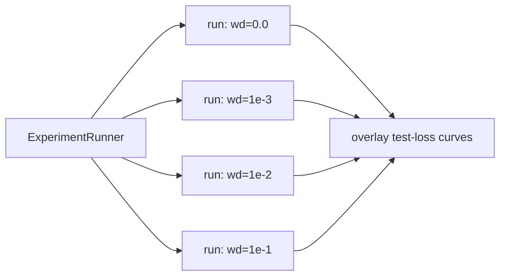

# Experiments

## Current experiment status

Grokking remains the active empirical focus, but **no successful grok has been observed yet**.

- `x^2` is implemented and available for ongoing runs; no grokking result is currently
  documented.
- The primality bit/one-hot comparison is complete and produced memorisation without
  generalisation.
- The modulo-residue-to-prime transfer experiment is implemented and verified; its first
  material long run is pending.
- Two-input modular addition remains proposed, not implemented.
- Parallel sweeps currently require separate single-run processes; the Phase 6
  `ExperimentRunner` does not exist yet.

Record material configurations and negative results as well as successes. A grokking claim
requires logged evidence of delayed held-out generalisation after the training fit.

## Flagship: grokking `f(x) = x^2`

### Goal

Train a tiny MLP to regress `x^2` on a **small** sample and keep training long after it has
fit the training data, watching for **grokking**: test loss stays high while train loss is
already low, then drops sharply — delayed generalisation.

### Setup (numbers finalised at the start of Phase 5)

- **Target:** `y = x^2` on `x` in `[-1, 1]`.
- **Data:** small train set (order ~10-20 points), larger held-out test/grid for evaluation.
  Small data is what makes memorise-then-generalise observable.
- **Model:** tiny MLP, starting point `1 -> 8 -> 8 -> 1` with `tanh` hidden activations
  (smooth target favours tanh over ReLU). Exact width decided when we implement.
- **Optimiser:** SGD **with weight decay** — weight decay is the primary grokking lever.
- **Training length:** long (well past the point train loss plateaus near zero).
- **Seed:** fixed and logged for reproducibility.

### What we log (see [LOGGING.md](LOGGING.md))

- `metrics.jsonl`: train/test loss, `weight_norm`, `grad_norm`, `lr` per step.
- `params.jsonl`: per-parameter value + grad (interval-gated; interval = 1 when we want a
  per-round parameter movie).
- `predictions.jsonl`: `y_hat` across a dense `x` grid at snapshot steps, for the prediction-
  curve video.

### Success / result criteria

- **Ideal:** a visible gap where test loss lags, then a sharp drop = grok.
- **Acceptable/documented:** if `x^2` only shows gradual generalisation (likely, since smooth
  regression lacks the sharp phase transition of algorithmic tasks), we document that and pivot
  the "sharp grok" demo to the fallback below. This is a learning outcome, not a failure.

### Fallback for a textbook-sharp grok: modular addition

Grokking was originally and most reliably shown on algorithmic tasks (Power et al., 2022), e.g.
`(a + b) mod p` as classification. If we want the dramatic curve, we add a second experiment:

- **Task:** `(a + b) mod p` for small prime `p`, framed as classification over `p` classes.
- **Model:** small MLP/embedding; heavy weight decay; train on a fraction of all `(a,b)` pairs.
- Reuses the same `Trainer`, logging, and viz — only `Dataset` and the output head change.

We lead with `x^2` (your stated interest, and a clean regression/visualisation story) and keep
two-input modular addition ready as the textbook-grok comparison. The implemented unary
modulo-residue transfer experiment below is different: it tests whether arithmetic
representations help primality rather than whether modular addition itself groks.

## Grokking experiment 2: primality on [2, 200]

- Status: **run** (Phase 5) — see [Actual results](#actual-results-phase-5) below.

### Goal

Classify "is `n` prime" for `n` in `[2, 200]`, training long past the point train loss
bottoms out, and watch whether test accuracy ever lifts off the base rate.

### Data

- 199 samples (`n = 2..200`), of which **46 are prime** (`π(200) = 46`), so the base rate is
  **23.1%**. A model that always predicts "not prime" scores 76.9% accuracy — which is why we
  log **accuracy alongside loss**, and why the comparison against base rate matters more than
  raw accuracy.
- Stratified ~50/50 train/test split, so both splits contain primes (23 each).
- **Unseen evaluation ranges** beyond the training pool, as separate splits:

| Split | Range | Samples | Primes | Base rate (always "composite") |
|---|---|---|---|---|
| `train` | subset of 2-200 | 100 | 23 | 77.0% |
| `test` | rest of 2-200 | 99 | 23 | 76.8% |
| `unseen_201_255` | 201-255 | 55 | 8 | 85.5% |
| `unseen_256_300` | 256-300 | 45 | 8 | 82.2% |

### The two encodings (this is the experiment)

| Encoding | Inputs | Why |
|---|---|---|
| `bits` | 9 (binary digits of `n`) | Bits are **shared structure** across inputs, so a rule learned on training integers can transfer to held-out ones. Generalisation is at least *possible*. |
| `onehot` | 199 (exactly one hot) | Deliberate **memorisation control**. Each integer is an independent symbol, so a held-out `n` has an input weight that was never trained. Test accuracy *cannot* beat the base rate. |

**Why 9 bits, not 8.** The input width is fixed when the network is constructed, so
evaluating on integers up to 300 requires 9 bits (which covers 2-511). Bit 8 is therefore
**always 0 throughout training** and switches on for the first time at `n = 256`. That makes
256-300 a strictly harder test than 201-255 — the network is being asked about a feature it
has literally never seen active — so the two ranges are logged as separate splits rather than
averaged together.

**One-hot has no unseen splits.** There is no input slot for 201-300 under one-hot, so
`Dataset::primes` produces only `train` and `test` for that encoding. That absence *is* the
control: the encoding makes generalisation beyond the training pool not merely hard but
structurally impossible.

Running both and overlaying them is the teaching result: it shows concretely that grokking
requires a generalisable structure to discover, not just weight decay and patience.

### Setup

- **Model:** `9 -> 32 -> 32 -> 1` (bits) / `199 -> 32 -> 32 -> 1` (one-hot), `tanh` hidden
  activations, **linear output** emitting a logit.
- **Loss:** `BceWithLogitsLoss` — binary cross-entropy with the sigmoid **fused in**. The naive
  `-[y log p + (1-y) log(1-p)]` overflows once `p` saturates; the fused form
  `max(z,0) - z·y + log(1 + e^-|z|)` is exact and never evaluates `exp` on a positive argument.
  Its gradient collapses to the very stable `(p - y)/N`.
- **Optimiser:** `SgdWeightDecay` — the grokking lever. Biases are not decayed.
- **Metrics:** loss + **accuracy** for every split, plus `weight_norm` and `grad_norm`.
- **Seed:** fixed and logged.

### Honest expectation

Primality is not compactly expressible by a small MLP over bit inputs — there is no neat
circuit analogous to the Fourier features that make modular arithmetic grok. Realistic
outcome: the `bits` run generalises **weakly above base rate** and may never show a sharp
phase transition; the `onehot` run flatlines at base rate by construction. Both are useful
results and we document whatever happens. Modular arithmetic (below) remains the
guaranteed-grok comparison.

Outcome: the `onehot` prediction was exactly right, and the `bits` prediction was *optimistic* —
it did not generalise weakly, it failed to generalise at all. Numbers below.

### Infrastructure Phase 5 added

All of it is now implemented:

1. **Vector-valued inputs** — `Dataset` became a set of named `Split`s with flat row-major
   inputs, targets, and a per-sample `id` ([../src/includes/api/dataset.hpp](../src/includes/api/dataset.hpp)).
2. **`Sigmoid`** — `nn::math::sigmoid` / `sigmoid_grad` (sign-branched, overflow-safe) plus
   `nn::core::SigmoidLayer`.
3. **`BceWithLogitsLoss`** — `nn::math::bce_with_logits` / `_grad` plus the `nn::core` wrapper.
   Two virtuals were added to the `Loss` base so the `Trainer` stays task-agnostic:
   `activate()` (identity for regression, sigmoid for BCE) and `is_classification()`.
4. **`SgdWeightDecay`** — `w -= lr * (g + λw)`, skipping `bias` parameters.
5. **Accuracy** — the `Trainer` now evaluates *every* non-train split at `eval_interval` and
   emits `accuracy` alongside `loss` when the loss is a classification loss.

### How to reproduce

```powershell
# bits (structure available, generalisation possible in principle)
.\build\src\app\train_primes\train_primes.exe --encoding bits `
  --steps 6000 --lr 0.5 --weight-decay 0.001 --hidden 32 --seed 42 `
  --name primes_bits --predict-interval 50

# onehot (memorisation control)
.\build\src\app\train_primes\train_primes.exe --encoding onehot `
  --steps 6000 --lr 0.5 --weight-decay 0.001 --hidden 32 --seed 42 `
  --name primes_onehot --predict-interval 50

# watch either one live, or snapshot afterwards
.\.venv\Scripts\python.exe src/app/python/primes_plot.py --live
.\.venv\Scripts\python.exe src/app/python/live_plot.py
```

### Actual results (Phase 5)

6000 steps, `lr = 0.5`, `weight_decay = 0.001`, `hidden = 32`, `seed = 42`. Accuracy is at the
final step; **base rate** is the score for always answering "composite".

| Run | Split | Final loss | Final accuracy | Base rate | Verdict |
|---|---|---|---|---|---|
| `bits` | train | 0.0057 | **100%** | 77.0% | memorised completely (100% by step 411) |
| `bits` | test | 1.356 | 75.8% | 76.8% | **at/below base rate — no generalisation** |
| `bits` | unseen_201_255 | 1.363 | 76.4% | 85.5% | **worse than always saying "composite"** |
| `bits` | unseen_256_300 | 1.283 | 71.1% | 82.2% | worse still, as predicted for the new bit |
| `onehot` | train | 0.0025 | **100%** | 77.0% | memorised by step 48 |
| `onehot` | test | 0.914 | 76.8% | 76.8% | **exactly the base rate**, by construction |

**No grok.** Train loss fell ~240x while every held-out loss *rose* monotonically to ~1.3 — the
textbook overfitting signature, not a delayed-generalisation one. Weight norm peaked at 11.47
(step 802) and weight decay then pulled it down to 9.38 by step 6000, with no accompanying
improvement on any held-out split. Weight decay was doing its job; there was simply no
generalising solution for it to find.

The then-current `onehot` heatmap was the cleanest teaching artefact: exactly the *training*
primes turned red and every other row stayed blue, so the model answered "composite" for all 99
test integers and landed precisely on the 76.8% base rate. The `bits` run looked superficially
busier — it scattered
confident red rows across the held-out ranges — but those are false positives, which is why it
scores *below* base rate on both unseen ranges.

The one genuine signal: `unseen_201_255` peaked at 87.3% accuracy at step 50 and
`unseen_256_300` at 82.2% at step 0, i.e. **early, before memorisation set in**. At that point
the network had learned little more than "even numbers are composite" (bit 0), which is a real
if trivial rule that transfers. Training then destroyed it in favour of memorising the training
set. Generalisation here does not arrive late — it departs early.

This is the expectation in the honesty note above, confirmed. Primality has no compact circuit
over bit inputs analogous to the Fourier features that make modular arithmetic grok, so the
`bits` encoding gives the optimiser *possible* structure but not *learnable* structure. The next
implemented question is whether an explicitly learned modular representation transfers to prime
generalisation; two-input modular addition remains the cleaner task if the sole goal is a
textbook grok.

## Experiment 3: modulo-residue pretraining transferred to primality

- Status: **implemented and smoke-verified; long-run result pending**.
- Executable: `train_prime_transfer`.

### Question

Can a shared encoder generalise primality better after first learning the periodic residue
structure that a sieve uses, while a frozen-encoder phase prevents prime-label training from
destroying that representation?

This is a transfer-learning experiment. It may generalise immediately or gradually; only a
substantially delayed held-out transition after the prime training fit should be called
grokking.

### Data

- Integers `2..500`, encoded as 9 binary inputs.
- Deterministic stratified `60/20/20` split:

| Split | Samples | Primes | Composites |
|---|---:|---:|---:|
| `train` | 299 | 57 | 242 |
| `validation` | 100 | 19 | 81 |
| `test` | 100 | 19 | 81 |

The same IDs belong to the same split in both phases. Residue pretraining uses only `train`;
validation and test inputs therefore remain unseen by all optimisation.

### Phase 1: cyclic residue representation

- Encoder: `9 -> 64 -> tanh -> 64 -> tanh`.
- Residue head: 16 linear outputs.
- Moduli: `2, 3, 5, 7, 11, 13, 17, 19` — every possible prime divisor needed for composites up
  to 500.
- Targets for each modulus `q`:
  `[sin(2*pi*n/q), cos(2*pi*n/q)]`.
- Loss: MSE.
- Optimiser: static-learning-rate SGD with weight decay.

Sine/cosine represents the cyclic topology correctly: residue `0` and residue `q-1` are nearby
on a circle rather than far apart scalar labels.

### Phase 2: frozen class-balanced prime head

- Remove the residue head.
- Freeze both encoder dense layers. Frozen blocks still propagate input gradients but do not
  accumulate parameter gradients and are skipped by SGD and weight decay.
- Add a new `64 -> 1` linear prime head.
- Loss: weighted BCE-with-logits.
- Automatic normalised inverse-frequency weights:
  `w_prime = N/(2*N_prime)` and `w_composite = N/(2*N_composite)`, approximately `2.623` and
  `0.618` for the implemented split.

### Generalisation evidence

Every binary metrics row contains raw accuracy, balanced accuracy, prime recall, composite
recall, precision, and TP/TN/FP/FN. Held-out metrics are emitted every 1000 steps in the
recommended run.

The dashboard uses conservative labels:

- `MEMORISED, NOT GENERALISING`: train balanced accuracy is at least 98% while held-out remains
  near 50%.
- `PARTIALLY GENERALISING`: held-out balanced accuracy rises above chance.
- `GENERALISING`: held-out balanced accuracy is at least 90%, both recalls are at least 80%, and
  all three conditions persist for three evaluations.
- `CANDIDATE GROKKING`: that sustained crossing occurs materially after the training fit.

### Recommended long run

```powershell
.\build\src\app\train_prime_transfer\train_prime_transfer.exe `
  --pretrain-steps 50000 --prime-steps 600000 `
  --pretrain-lr 0.1 --prime-lr 0.5 `
  --weight-decay 0.0003 --hidden 64 --seed 42 `
  --eval-interval 1000 --param-log-interval 10000 `
  --name prime_transfer_500
```

Watch the same run live in two more terminals:

```powershell
.\.venv\Scripts\python.exe src/app/python/primes_plot.py --live
.\.venv\Scripts\python.exe src/app/python/live_plot.py
```

Both training phases append to one `runs/<run_id>/` directory with continuous global steps.
`primes_plot.py` shows whole-run progress, generalisation metrics, the latest held-out confusion
matrix, and the current status. `live_plot.py` retains the lower-level loss and norm view.

### Controls and follow-ups

Compare the result with scratch-trained width-32 and width-64 prime models before attributing any
gain to transfer. If the frozen linear head cannot fit, the next controlled follow-up is to
unfreeze only the upper encoder layer at a smaller static learning rate; do not silently change
that variable inside this baseline.

## Planned Phase 6: parallel comparison runs

Runs are already isolated by `run_id`, but the orchestration layer is not implemented. Phase 6
will design `ExperimentRunner`, launch several configurations concurrently, and overlay their
results. A natural first sweep:



- **Weight-decay sweep:** the clearest illustration of what triggers grokking.
- Other easy sweeps: learning rate, hidden width, train-set size.
- Comparison plot: overlay `test loss` vs `step` (log x-axis) for all runs, pulled with one
  DuckDB query over `runs/*/metrics.jsonl`.

The isolation layout is ready for this work, but provenance/metadata rectifications should be
completed before relying on large parallel comparisons.

## Outputs

- **Prime generalisation dashboard** (`src/app/python/primes_plot.py`): scalable whole-run
  progress, phase/split loss, balanced accuracy, per-class recall, confusion matrix, and
  conservative generalisation/grokking status. Supports `--live` and `--snapshot`.
- **Live loss curve** (`src/app/python/live_plot.py`, Phase 4): implemented.
- **Post-hoc `.mp4`** from loss/prediction logs: planned for Phase 7.
- **Per-parameter evolution video** from `params.jsonl`: optional Phase 7 work.
- **Comparison figures across parallel runs:** planned for Phase 6.
