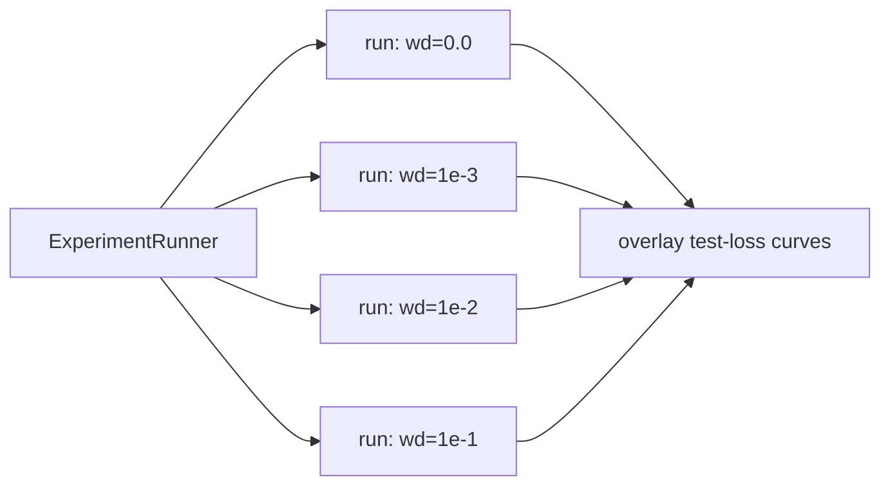

# Experiments

## Flagship: grokking `f(x) = x^2`

### Goal

Train a tiny MLP to regress `x^2` on a **small** sample and keep training long after it has
fit the training data, watching for **grokking**: test loss stays high while train loss is
already low, then drops sharply — delayed generalisation.

### Setup (numbers finalised at the start of Phase 5)

- **Target:** `y = x^2` on `x` in `[-1, 1]`.
- **Data:** small train set (order ~10-20 points), larger held-out test/grid for evaluation.
  Small data is what makes memorise-then-generalise observable.
- **Model:** tiny MLP, starting point `1 -> 8 -> 8 -> 1` with `tanh` hidden activations
  (smooth target favours tanh over ReLU). Exact width decided when we implement.
- **Optimiser:** SGD **with weight decay** — weight decay is the primary grokking lever.
- **Training length:** long (well past the point train loss plateaus near zero).
- **Seed:** fixed and logged for reproducibility.

### What we log (see [LOGGING.md](LOGGING.md))

- `metrics.jsonl`: train/test loss, `weight_norm`, `grad_norm`, `lr` per step.
- `params.jsonl`: per-parameter value + grad (interval-gated; interval = 1 when we want a
  per-round parameter movie).
- `predictions.jsonl`: `y_hat` across a dense `x` grid at snapshot steps, for the prediction-
  curve video.

### Success / result criteria

- **Ideal:** a visible gap where test loss lags, then a sharp drop = grok.
- **Acceptable/documented:** if `x^2` only shows gradual generalisation (likely, since smooth
  regression lacks the sharp phase transition of algorithmic tasks), we document that and pivot
  the "sharp grok" demo to the fallback below. This is a learning outcome, not a failure.

### Fallback for a textbook-sharp grok: modular arithmetic

Grokking was originally and most reliably shown on algorithmic tasks (Power et al., 2022), e.g.
`(a + b) mod p` as classification. If we want the dramatic curve, we add a second experiment:

- **Task:** `(a + b) mod p` for small prime `p`, framed as classification over `p` classes.
- **Model:** small MLP/embedding; heavy weight decay; train on a fraction of all `(a,b)` pairs.
- Reuses the same `Trainer`, logging, and viz — only `Dataset` and the output head change.

We lead with `x^2` (your stated interest, and a clean regression/visualisation story) and keep
modular arithmetic ready as the guaranteed-grok comparison.

## Parallel comparison runs

Because runs are isolated by `run_id`, we launch several configs at once via
`ExperimentRunner` and overlay them. Natural first sweep:

- **Weight-decay sweep:** the clearest illustration of what triggers grokking.
- Other easy sweeps: learning rate, hidden width, train-set size.
- Comparison plot: overlay `test loss` vs `step` (log x-axis) for all runs, pulled with one
  DuckDB query over `runs/*/metrics.jsonl`.

Adding more runs later is free — just launch more; nothing needs restructuring.

## Outputs

- Live loss curve during training (Phase 4).
- Post-hoc `.mp4`: loss curves + evolving prediction curve overlaid on the true `x^2`.
- Optional per-parameter evolution video from `params.jsonl`.
- Comparison figures across parallel runs.
