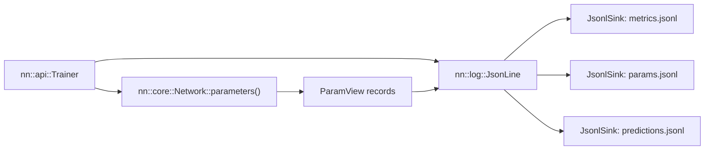

# Logging

Logging is a first-class part of the training design. The current implementation uses
hand-written `JsonLine` records and buffered `JsonlSink` files, keeping the C++ runtime free of a
third-party JSON dependency.

## Implemented contract



The pieces have deliberately small responsibilities:

- `Loggable` is an abstract identity interface containing only `log_name()`.
- `Network` and `DenseLayer` implement `Loggable`.
- `Layer` and `Trainer` do not inherit `Loggable`.
- `ParamView` exposes a named parameter block, its gradient span, and its shape.
- `Trainer` decides when to evaluate and serialise current state.
- `JsonLine` builds one JSON object string from the primitive types the project logs.
- `JsonlSink` writes complete strings, adds the newline, buffers, and flushes by count/time.

There is no `to_json()` virtual and no nlohmann/json dependency.

## Run isolation

Every `Trainer` constructs a generated `run_id` and creates its own directory:

```text
runs/
  <run_id>/
    config.json
    meta.json
    metrics.jsonl
    params.jsonl
    predictions.jsonl
    config_<phase>.json  # present for staged runs
```

The directory is the isolation boundary. Independent runs do not share mutable sinks.

### Current `config.json` and phase configs

The current object contains:

- `run_id`, `name`, `experiment`, `phase`, `seed`;
- `lr`, `weight_decay`, `steps`;
- `step_offset`, `total_steps`, and evaluation/parameter/prediction/flush cadences;
- model/loss/optimiser descriptions and positive/negative class weights;
- `input_dim`, `output_dim`, `classification`, and `phase_classification`;
- one `size_<split>` field for each dataset split.

The first phase writes `config.json`; every phase writes `config_<phase>.json`. Model topology
is currently human-readable rather than a complete structured manifest, selected prediction
splits are not persisted, and git revision/dirty-worktree state are absent. The remaining work
is tracked as RECT-001 in [RECTIFICATIONS.md](RECTIFICATIONS.md).

### Current `meta.json`

At run start, the file contains `run_id`, `start`, and `"status":"running"`. At successful
completion it is overwritten with `run_id`, `end`, and `"status":"done"`. The final file
therefore does not preserve the start time or host, and interrupted/failed state is incomplete.
RECT-002 tracks the lifecycle fix.

## Stream schemas

All stream records are one valid JSON object per line.

### `metrics.jsonl`

One training row is emitted every step:

```json
{"run_id":"...","step":1200,"phase":"prime_head","split":"train","loss":0.0123,"lr":0.01,"weight_norm":4.87,"grad_norm":0.31,"wall_ms":1543}
```

Every non-train split is evaluated at `eval_interval` and on the final step:

```json
{"run_id":"...","step":1200,"split":"test","loss":0.021}
```

Classification rows also contain `accuracy`. Regression rows omit it. Optimiser state/norm
fields occur on the train row only. The current schema has no `epoch` field because training is
step-based full-batch work.

Single-output classification rows additionally contain:

- `balanced_accuracy`, `prime_recall`, `composite_recall`, and `precision`;
- `true_positive`, `true_negative`, `false_positive`, and `false_negative`.

Staged experiments append their phases to the same file. `step` is the continuous global step
and `phase` identifies which task/head produced the row.

### `params.jsonl`

One row per parameter per logged step:

```json
{"step":1200,"phase":"prime_head","layer":"dense.0","kind":"weight","row":3,"col":5,"value":0.214,"grad":-0.0007}
```

Writes are gated by `param_log_interval`. The row currently has no `run_id`; its parent directory
identifies the run.

### `predictions.jsonl`

One row per selected sample per logged step:

```json
{"step":1200,"phase":"prime_head","split":"test","id":97,"target":1,"pred":0.83}
```

`id` is the split's independent sample identity: the integer `n` for primes or the `x` value for
`x^2`. `pred` is passed through `Loss::activate()`, producing classifier probability or raw
regression output. `RunConfig::predict_splits` controls which splits are written; empty means
all. These rows also rely on the parent directory for run identity.

Whether to add `run_id` to every stream is tracked as RECT-003.

## Volume and flushing

A small network can still produce millions of long-format parameter rows. To keep logging usable:

- `JsonlSink` buffers and flushes every configured record count.
- It also flushes after `flush_interval_ms`, allowing live readers to see slow runs.
- Destruction and explicit `flush()` write remaining rows.
- `param_log_interval = 1` is reserved for deliberate per-step parameter traces.

For repeated heavy analysis, generated parameter data can be promoted to Parquet.

## Querying

Metrics can be safely queried across runs because each row carries `run_id`:

```sql
SELECT run_id, step, loss
FROM 'runs/*/metrics.jsonl'
WHERE split = 'test'
ORDER BY run_id, step;
```

Until RECT-003 is resolved, query parameter/prediction streams one run at a time or include the
source filename so run identity is not lost:

```sql
SELECT filename, step, layer, kind, row, col, value, grad
FROM read_json_auto('runs/*/params.jsonl', filename = true);
```

Pandas can read a single stream directly:

```python
import pandas as pd

metrics = pd.read_json("runs/<id>/metrics.jsonl", lines=True)
```

## Visualisation

Implemented live tools are documented in [STATUS.md](STATUS.md). `make_video.py` and `query.py`
belong to future Phase 7; the intended post-hoc pipeline is query logs, render frames, then stitch
them with imageio/ffmpeg without retraining.
