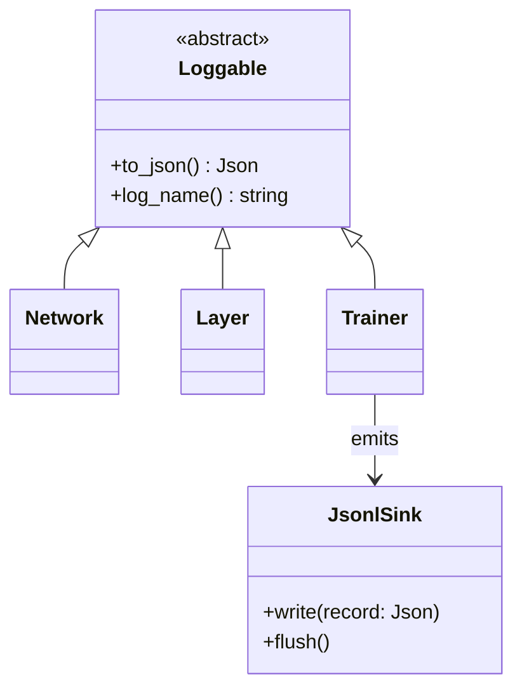

# Logging

Logging is a **first-class citizen**. Anything worth observing during training implements the
`Loggable` abstract base, and a sink writes structured **JSONL** (one JSON object per line) to
per-run files. This makes runs queryable, comparable, and turnable into video.

## The `Loggable` contract



Sketch (subject to our Phase 3 discussion):

```cpp
class Loggable {
public:
  virtual ~Loggable() = default;
  virtual std::string log_name() const = 0;   // stable identifier, e.g. "layer.dense.0"
  virtual nlohmann::json to_json() const = 0;  // current state snapshot
};
```

A component inherits `Loggable` and exposes its state; the `Trainer` decides *when* to pull and
emit it (every step for scalars, every N steps for heavy per-param data).

## Run isolation (supports parallel experiments)

Every run gets a unique `run_id` and its own directory, so parallel runs never collide:

```
runs/
  20260712T110000_x2grok_ab12cd/
    config.json        # full RunConfig + git hash + seed
    meta.json          # start/end time, host, status
    metrics.jsonl      # per-step scalars (light, high frequency)
    params.jsonl       # per-parameter snapshots (heavy, interval-gated)
    predictions.jsonl  # sampled y vs y_hat for curve/video frames
```

## Stream schemas

Keeping streams separate is deliberate: `metrics.jsonl` stays small and fast to scan;
`params.jsonl` (the big one) is only read when we actually need per-param detail.

### `metrics.jsonl` — one line per step

```json
{"run_id":"...","step":1200,"epoch":6,"split":"train","loss":0.0123,"lr":0.01,"weight_norm":4.87,"grad_norm":0.31,"wall_ms":1543}
```

A matching line is emitted for **every non-train split** at `eval_interval` — `test` plus, for
the primes experiment, `unseen_201_255` and `unseen_256_300`. Those extra lines carry only
`loss` (and `accuracy`); `lr`, `weight_norm` and `grad_norm` describe the optimiser state and
appear on the `train` row alone.

For a **classification** run (`Loss::is_classification()`), every metrics line also carries
`"accuracy"`. Regression runs omit the field entirely rather than logging a meaningless zero.

### `params.jsonl` — per-parameter, interval-gated

This is your "error/loss on every param during each round" stream. To keep it sane it is
written every `param_log_interval` steps (configurable; can be 1 to capture every round).

```json
{"run_id":"...","step":1200,"layer":"dense.0","kind":"weight","row":3,"col":5,"value":0.214,"grad":-0.0007}
```

One line per parameter per logged step. Long-format (one row per param) is intentional: it's the
shape DuckDB/pandas want for grouping and time series.

### `predictions.jsonl` — one row per sample per logged step

```json
{"step":1200,"split":"test","id":97,"target":1,"pred":0.83}
```

`id` is the sample's identity from its `Split` — the integer `n` for primes, the `x` value for
`x^2` — and is the independent variable when plotting. `pred` is passed through
`Loss::activate()`, so it is a probability for a classifier and the raw output for a regressor.

One schema for both tasks is what lets a single stream feed both the `x^2` prediction curve and
the primes heatmap. Which splits get written is controlled by `RunConfig::predict_splits`
(empty means all); `train_x2` narrows it to its dense `grid` split.

## Volume and performance

A 1->8->8->1 net has ~97 parameters. Logging every param every step for 100k steps is ~9.7M
rows in `params.jsonl`. That's fine on disk (JSONL streams, no memory blowup) but:

- **Buffer + flush:** `JsonlSink` buffers writes and flushes every `flush_interval` (also on a
  timer) so the live Python plotter sees fresh data without us fsync-ing every line.
- **Gate the heavy stream:** default `param_log_interval` > 1 for long runs; set to 1 when we
  specifically want a per-round param movie.
- **Promote to Parquet for repeated heavy analysis** (see below).

## Querying

### DuckDB (recommended)

SQL directly over the files, no import step:

```sql
-- loss curves for every parallel run
SELECT run_id, step, loss
FROM 'runs/*/metrics.jsonl'
WHERE split = 'test'
ORDER BY run_id, step;

-- trajectory of a single weight over training (for a param-evolution video)
SELECT step, value, grad
FROM 'runs/20260712T110000_x2grok_ab12cd/params.jsonl'
WHERE layer = 'dense.0' AND kind = 'weight' AND row = 3 AND col = 5
ORDER BY step;
```

For repeated heavy queries, convert once to Parquet (columnar, compressed, fast):

```sql
COPY (SELECT * FROM 'runs/<id>/params.jsonl')
TO 'runs/<id>/params.parquet' (FORMAT parquet);
```

### pandas / jq

```python
import pandas as pd
m = pd.read_json("runs/<id>/metrics.jsonl", lines=True)
```

```bash
jq -c 'select(.split=="test") | {step, loss}' runs/<id>/metrics.jsonl
```

## Video pipeline (Python)

1. Query per-step frames with DuckDB (loss curve so far + current prediction curve).
2. Render each frame with matplotlib.
3. Stitch with `imageio`/ffmpeg into `.mp4`.

Because frames are reconstructed from logs, video generation is fully **post-hoc and
reproducible** — rerun it any time, at any frame rate, without retraining.
