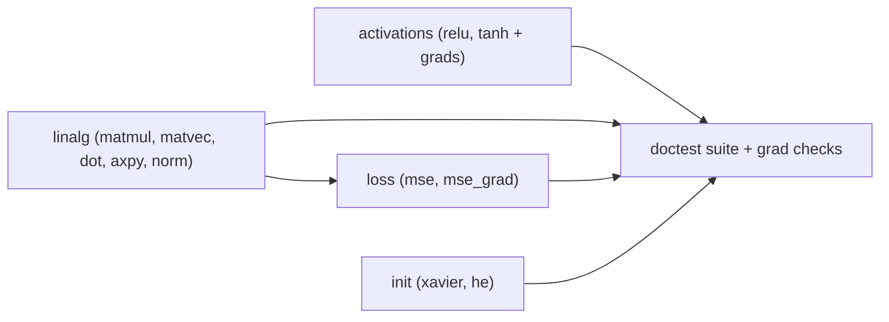

# Phase 1 Plan — Math Layer (`nn::math`)

**Goal:** implement the functional, pure math primitives the whole network builds on, each with
unit tests and (where a gradient exists) a numeric gradient check. No objects/classes here —
this layer is free functions only (see `docs/CPP_CONVENTIONS.md`).

**Exit criteria**
- All primitives below implemented in `src/includes/helpers/` (declarations) + `src/helpers/`
  (implementations), namespace `nn::math`.
- `ctest` green: closed-form unit tests pass; numeric gradient checks within tolerance.
- Every op operates on `std::span` views; no hidden allocation, no global state.

## Decisions locked for this phase

- Scalar type: **`double`** (accuracy first; revisit `float` for perf/GPU later).
- Data layout: flat `std::vector<double>` owned by callers; math takes `std::span<const double>`
  (in) / `std::span<double>` (out). Matrices are **row-major**, shape passed explicitly.
- Test framework: **doctest** (single-header) via CMake `FetchContent`. Lightweight, fast.
- Gradient checks: **central finite differences**, `|analytic - numeric| < 1e-6` (tunable).

## Proposed `nn::math` API (confirm before coding)

Grouped by file. Signatures are the thing to sign off on.

### `linalg.hpp`
```cpp
namespace nn::math {
// C[MxN] = A[MxK] * B[KxN], row-major
void matmul(std::span<const double> A, std::span<const double> B,
            std::span<double> C, std::size_t M, std::size_t K, std::size_t N);

// y[M] = A[MxN] * x[N]
void matvec(std::span<const double> A, std::span<const double> x,
            std::span<double> y, std::size_t M, std::size_t N);

double dot(std::span<const double> a, std::span<const double> b);
void   axpy(double alpha, std::span<const double> x, std::span<double> y); // y += a*x
double l2_norm(std::span<const double> v);
}
```

### `activations.hpp`
```cpp
namespace nn::math {
void relu(std::span<const double> z, std::span<double> out);
void relu_grad(std::span<const double> z, std::span<double> out);   // 1 if z>0 else 0
void tanh_(std::span<const double> z, std::span<double> out);
void tanh_grad(std::span<const double> z, std::span<double> out);   // 1 - tanh(z)^2
}
```

### `loss.hpp`
```cpp
namespace nn::math {
double mse(std::span<const double> y_hat, std::span<const double> y);
// dL/dy_hat = 2*(y_hat - y)/N
void   mse_grad(std::span<const double> y_hat, std::span<const double> y,
                std::span<double> grad_out);
}
```

### `init.hpp`
```cpp
namespace nn::math {
// Fill weights in-place using a seeded RNG (seed recorded in RunConfig later)
void xavier_uniform(std::span<double> w, std::size_t fan_in, std::size_t fan_out, std::uint64_t seed);
void he_uniform(std::span<double> w, std::size_t fan_in, std::uint64_t seed);
}
```

## Build order



1. `linalg` + its tests.
2. `activations` + tests (incl. grad checks vs finite diff).
3. `loss` + tests (closed form + grad check).
4. `init` + tests (statistical: mean ~0, variance in expected band, deterministic per seed).

## Testing approach

- `tests/CMakeLists.txt` pulls doctest via `FetchContent`, registers a `nn_tests` target with
  `add_test`.
- Reusable helper `numeric_grad(f, x, i, h)` (central difference) for gradient checks.
- Each op: at least one hand-computed small case + one property/gradient test.

Example gradient-check shape:
```cpp
// For f(z)=sum(relu(z)), analytic d/dz_i == relu_grad(z)_i, compare to central difference.
```

## What I need you to confirm before executing

1. **Function signatures / grouping** above (names, `std::span` + explicit shapes, row-major).
2. **`double`** as the scalar type for now.
3. **doctest via FetchContent** for tests (vs hand-rolled asserts or Catch2).
4. Tolerance `1e-6` for numeric gradient checks.
